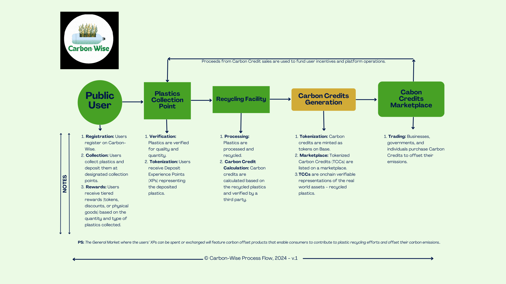

# Carbon-Wise

## Overview

**Carbon Wise**  is an innovative platform designed to combat plastic waste by transforming recycling efforts into measurable and tradeable carbon credits. By leveraging blockchain technology, Carbon-Wise empowers communities to participate in sustainability initiatives while providing financial incentives for recycling activities.

## The Platform: Carbon-Wise

**Carbon-Wise** is a platform that tokenizes real-world assets (recycled plastic) to create a transparent and verifiable market for carbon credits. Our platform enables users to deposit plastic waste at designated collection points in exchange for Deposit Tokens, which can be spent in the general marketplace. The collected plastics are then sent to recycling facilities where they are processed and converted into verifiable carbon credits. The verifiable carbon credits are then tokenized and sold to individuals, companies and governments seeking to reduce their emissions level.

## Key Objectives:
- Reduce plastic pollution in Africa.
- Generate verifiable carbon credits from recycled plastics.
- Foster community engagement through rewards and education.

## Features
- **User-Friendly Interface:** Intuitive design for easy navigation and interaction.
- **Tokenization of Real-World Assets:** Transform recycled plastics into carbon credits.
- **Real-Time Notifications:** Keep users informed about their recycling activities and rewards.
- **Personalised Dashboards:** Tailored insights for recyclers, businesses, and administrators.
- **Blockchain Integration:** Ensure transparency and traceability of transactions.

## Deployed Contract Addresses on Base Sepolia

- **USDToken** - 0xf94A277cea999f1a1F664969F88bfec7fbd90A64

- **CarbonWise** - 0x7516A44fF7e991035bC98F6810e957a98c8F8Fb3

- **Carbon Credit Token** - 0xe055EC9ff05a73ddf9772e9Ec819b529098C332c

- **EventMarketPlace** - 0x720E9140553596E3E96089b3B3937e0EA9fBc557

- **CcMarketPlace** - 0x1d3b5134F84D405A15EAbc7f62a4F3F97a55D4e2

## License

The smart contracts are released under the UNLICENSED and MIT licenses, allowing for open use, modification, and distribution. However, ensure a clear understanding of the code and its functionality before deploying it in a production environment.

## Contributing

We welcome contributions! You can open an issue or submit a pull request.